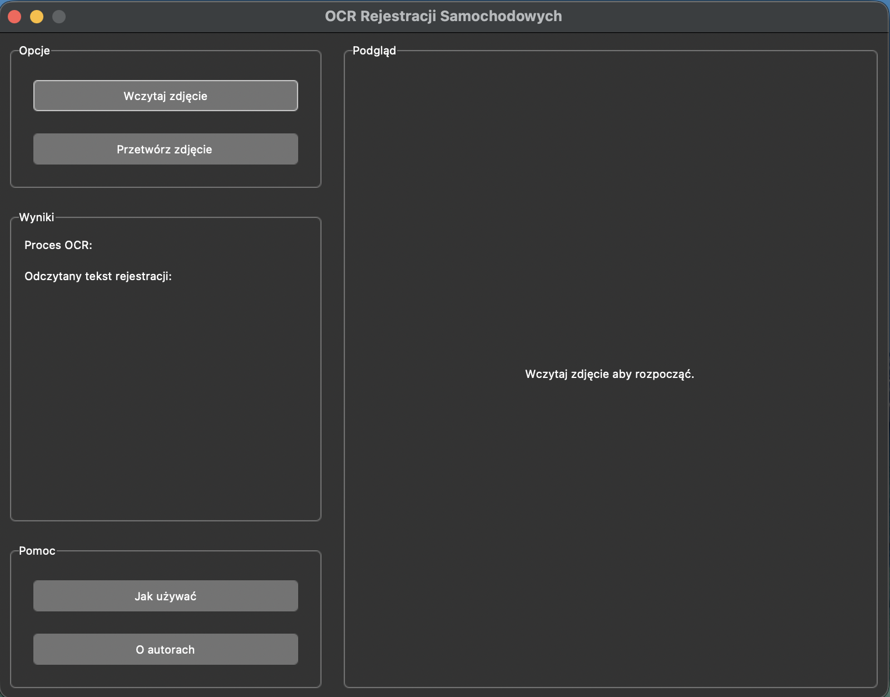
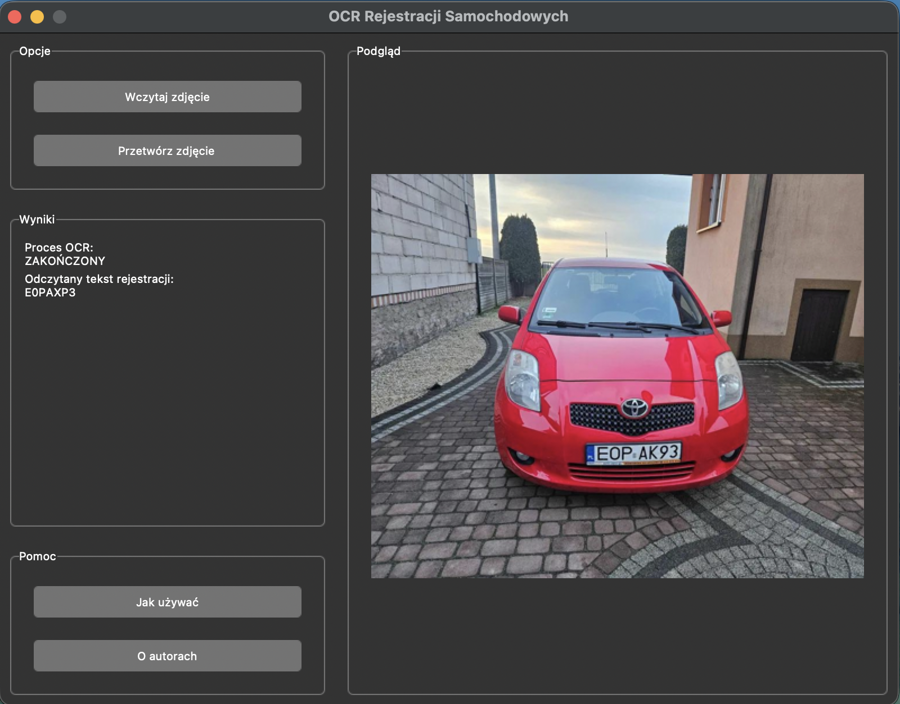
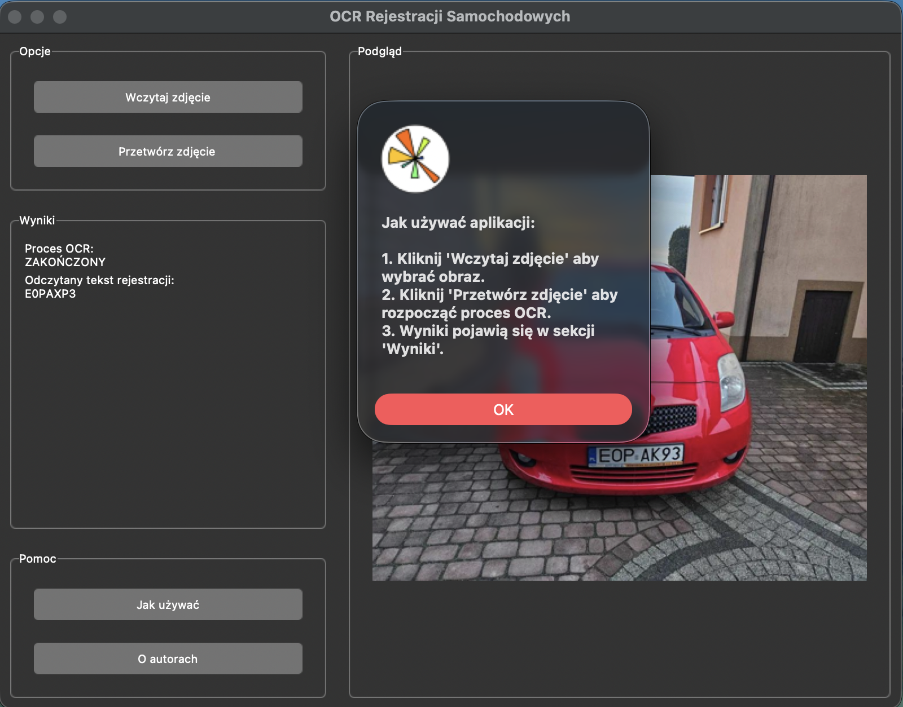

# OCR plate reader
An end‑to‑end OCR system for reading car license plates from photos, with a desktop GUI. The pipeline locates the plate in a photo, segments individual characters, and classifies each one with a custom-trained CNN. 

The core image-processing operations (Sobel edge detection, projection profiles, convolution/blur kernels) are implemented from scratch with NumPy.

## How to Run
Please create the virtual environment containing libraries from [requirements.txt](requirements.txt) and run:
```bash
python3 main.py
```
The example flow of the app usage:

Main Window:


OCR Results:


Instructions View:



## Technologies
- Python
- NumPy
- TensorFlow / PyTorch
- Tkinter
- Matplotlib